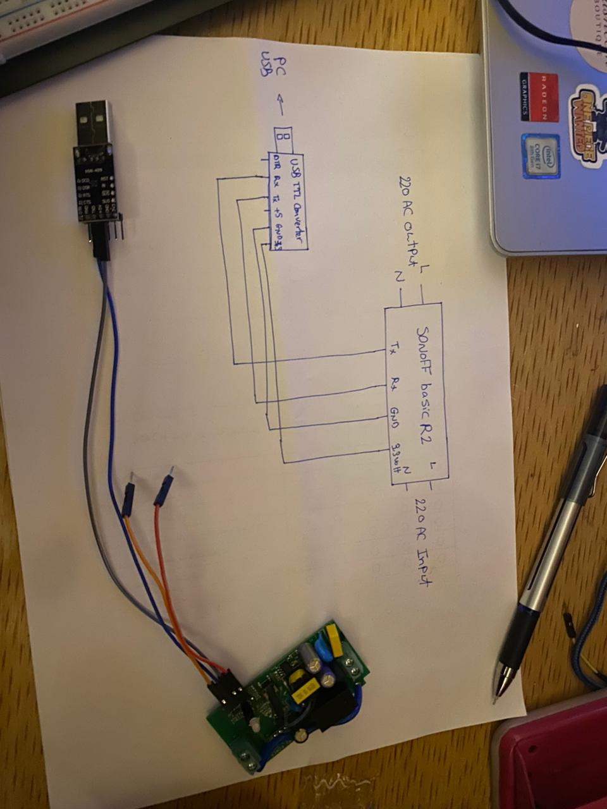

# SONOFF BasicR2 Smart Switch Project

## Overview
This project is all about turning a SONOFF BasicR2 smart switch into a fully customizable IoT device. By flashing custom firmware onto its ESP8266 microcontroller, you can control appliances remotely using MQTT. Whether you're a beginner or an advanced user, this guide will walk you through the entire setup, from wiring to troubleshooting.

## Project Structure
```
sonoff-project/
├── firmware/        # ESP8266 firmware code
├── docs/            # Documentation, wiring diagrams, troubleshooting
├── images/          # Wiring diagrams and screenshots
├── config/          # MQTT and Wi-Fi configuration files
├── tools/           # Scripts for automation (flashing, MQTT testing, etc.)
├── README.md        # Project overview and setup guide
└── LICENSE          # Open-source license (MIT)
```

## Hardware Components & Purchase Links
- **[Sonoff BASICR2 Wi-Fi Smart Switch](https://makerselectronics.com/product/sonoff-basicr2-wi-fi-diy-smart-switch?srsltid=AfmBOoqasegiy2BBPPESW4KlHC6pUYWSTEYUW-GuiiejeEcG1BcyENYC)** – The main device controlling appliances.
- **[CP2102 USB-to-TTL Converter](https://makerselectronics.com/product/cp2102-usb-2-0-to-ttl-uart-serial-converter-module-5-pin)** – Used to flash firmware (works perfectly).
- **[PL2303 USB-to-TTL Converter](https://makerselectronics.com/product/pl2303-usb-ttl-converter-module)** – Alternative to CP2102 but caused driver issues during firmware upload.
- **[Breadboard Power Supply Module MB102](https://makerselectronics.com/product/breadboard-power-supply-module-mb102?campaignid=20503411856&adgroid=up&network=x&device=c&campaignname=sales_pmax&gad_source=1&gclid=CjwKCAiA5eC9BhAuEiwA3CKwQisTskbinh0KYEqz6HK5Xtfh68w4p3QtMBEzFWRX6KRBZLKPPDOPphoCEgMQAvD_BwE)** – Provides stable 3.3V/5V power.
- **[Breadboard & Jumper Wires](https://makerselectronics.com/)** – For prototyping connections.
- **[Male Pin Headers](https://makerselectronics.com/)** – For making connections easier on the SONOFF board.

## Software Requirements
- **[Arduino IDE](https://www.arduino.cc/)** (with ESP8266 board package)
- **[PlatformIO](https://platformio.org/)** (optional, advanced firmware development)
- **[esptool.py](https://github.com/espressif/esptool)** (for flashing firmware via CLI)
- **[MQTT Explorer](http://mqtt-explorer.com/ )** (for IoT communication)
- **[Postman](https://www.postman.com/)** (for API testing during Wi-Fi configuration)

## Wiring Guide
### **Connections for Flashing the SONOFF BasicR2**
| USB-to-TTL Converter | SONOFF BasicR2 |
|----------------------|---------------|
| TX                  | RX            |
| RX                  | TX            |
| GND                 | GND           |
| 3.3V                | 3.3V          |

> **⚠️ Important:** Never connect 220V AC power to the SONOFF BasicR2 while connected to your PC via USB!




## Configuring MQTT
- **Default MQTT broker:** `mqtt://your-mqtt-broker.com:1883`
- **MQTT Topics:**
  - **Subscribe:** `smart-home/iot/device/status`
  - **Publish Commands:** `smart-home/device/control`
- **Example MQTT Payload:**
  ```json
  {
    "deviceId": 123,
    "value": "on"
  }
  ```

## Uploading Code to the Board
1. Connect the USB-to-TTL converter to the SONOFF BasicR2 as per the wiring instructions.
2. Open the **Arduino IDE** or **PlatformIO** and load the firmware code.
3. Select **Generic ESP8266 Module** under `Tools > Board`.
4. Adjust the following settings:
   - **Flash Mode:** DIO
   - **Flash Size:** 1M (64K SPIFFS)
   - **Upload Speed:** 115200
   - **CPU Frequency:** 80 MHz
5. Put the SONOFF in **flash mode**:
   - Hold the push button while connecting power.
   - Release after 5 seconds.
6. Click **Upload** in Arduino IDE or PlatformIO to flash the firmware.
7. Open the Serial Monitor (`115200 baud rate`) to verify the output.

## How the Board Will Behave After Flashing
- Upon power-up, the **SONOFF BasicR2** will attempt to connect to the last known Wi-Fi network.
- If it fails, it will enter **AP mode**, creating a Wi-Fi hotspot named `AP User` with password `pass`.
- Once connected to Wi-Fi, it will:
  - Subscribe to the configured **MQTT broker**.
  - Listen for commands on the assigned topics.
  - Respond to requests to toggle the relay (turn appliances ON/OFF).
  - Publish status updates (e.g., online/offline, switch state changes).
- Pressing the **push button** will manually toggle the relay and update the MQTT status.
- The **LED indicator** will reflect different states:
  - **Slow blinking** → Connecting to Wi-Fi.
  - **Fast blinking** → AP mode active.
  - **Solid ON** → Connected to MQTT and functioning normally.

## Troubleshooting
### **Wi-Fi Not Connecting?**
- Make sure the router is **2.4GHz** (ESP8266 does not support 5GHz).
- Double-check your Wi-Fi SSID and password.
- Restart the SONOFF and try again.

### **ESP8266 Flashing Issues?**
- Double-check wiring (TX ↔ RX, RX ↔ TX, GND connected).
- Ensure SONOFF is in **flash mode**.
- Try lowering upload speed (`Tools > Upload Speed > 115200`).
- If using PL2303, install **legacy drivers**.

### **MQTT Not Working?**
- Ensure MQTT credentials are correct.
- Make sure the broker is online.
- Test MQTT with **MQTT Explorer** to debug topics.

## Next Steps
- Implement **OTA (Over-the-Air) updates** for wireless firmware flashing.
- Add **Home Assistant integration** for home automation.
- Expand sensor support (temperature, motion, etc.).
- Develop a **mobile app interface** for remote control.

---

